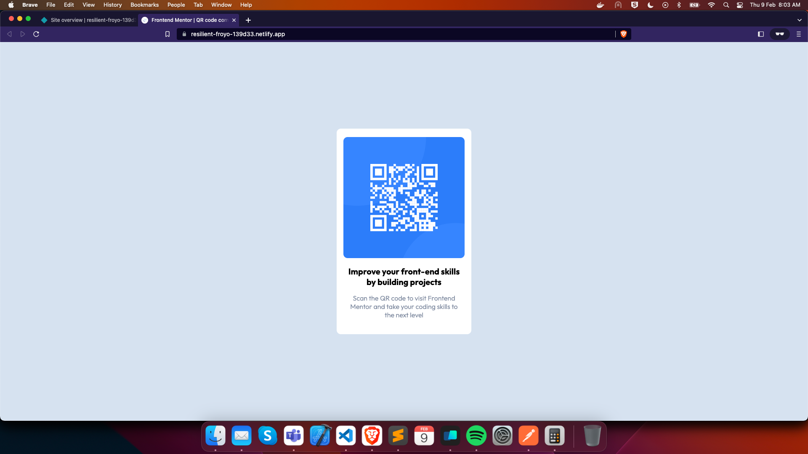

# Frontend Mentor - QR code component solution

This is a solution to the [QR code component challenge on Frontend Mentor](https://www.frontendmentor.io/challenges/qr-code-component-iux_sIO_H). Frontend Mentor challenges help you improve your coding skills by building realistic projects. 

## Table of contents

- [Overview](#overview)
  - [Screenshot](#screenshot)
  - [Links](#links)
- [My process](#my-process)
  - [Built with](#built-with)
- [Author](#author)
- [Acknowledgments](#acknowledgments)

## Overview
Simple Card Component for practice
### Screenshot

### Links

- Solution URL: [Add solution URL here](https://github.com/khazaddoom/frontend-mentor-challenges/tree/main/qr-code-component-main)
- Live Site URL: [Add live site URL here](https://resilient-froyo-139d33.netlify.app/)

## My process

- Mobile First Approach
- On a Careful look this doesnt need any desktop styles at all
- Since web is responsive by nature adjust styles to match both mobile and desktop designs.
- Fonts are usually "there is no one way to implement" kind of thing for me
- So for fonts i have gone "just basic imports" (could have hosted locally!)
### Built with

- Semantic HTML5 markup
- CSS custom properties
- CSS Grid
- Mobile-first workflow

## Author

- Frontend Mentor - [@ganeshsacharya](https://www.frontendmentor.io/profile/ganeshsacharya)

## Acknowledgments

- the rounded border matching exactly to the design could be a thing to be careful off!
- making the title and subtitle match the exact design specs could be challenging
